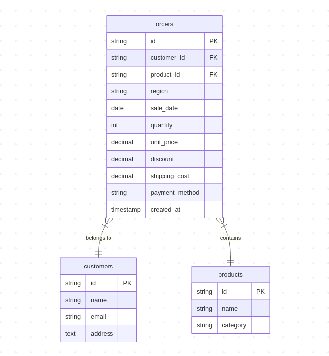

# Sales Analysis System

A Go-based system for analyzing sales data from CSV files with MySQL backend.

## Schema Diagram



## Prerequisites

- Go 1.23 or higher
- MySQL 8 or higher

## Setup

1. Create MySQL database:
   ```sql
   CREATE DATABASE sales_db;
   ```

2. Configure environment:
   Update DATABASE_URL in .env with your MySQL credentials

3. Run schema migrations:
   ```bash
   mysql -u root -p sales_db < schema.sql
   ```

4. Install dependencies:
   ```bash
   go mod download
   ```

5. Start server:
   ```bash
   go run .
   ```

## API Endpoints

### Data Management

#### Refresh Data
- **URL**: `/api/data/refresh`
- **Method**: `POST`
- **Description**: Load/refresh data from CSV file
- **Response**: 
  ```json
  {"status": "success"}
  ```

### Analysis

#### Revenue Analysis
- **URL**: `/api/analysis/revenue`
- **Method**: `GET`
- **Query Parameters**:
  - `start_date`: Start date (YYYY-MM-DD)
  - `end_date`: End date (YYYY-MM-DD)
  - `region`: (Optional) Filter by region
- **Response**:
  ```json
  {
    "total_revenue": 1000.00,
    "by_product": {
      "Product A": 500.00,
      "Product B": 500.00
    },
    "by_category": {
      "Electronics": 800.00,
      "Clothing": 200.00
    },
    "by_region": {
      "North America": 600.00,
      "Europe": 400.00
    }
  }
  ```

#### Top Products Analysis
- **URL**: `/api/analysis/products`
- **Method**: `GET`
- **Query Parameters**:
  - `start_date`: Start date (YYYY-MM-DD)
  - `end_date`: End date (YYYY-MM-DD)
  - `limit`: (Optional) Number of top products to return (default: 10)
- **Response**:
  ```json
  {
    "top_overall": [
      {
        "product_id": "P123",
        "name": "Product A",
        "category": "Electronics",
        "total_sold": 100,
        "total_revenue": 50000.00
      }
    ],
    "top_by_category": {
      "Electronics": [
        {
          "product_id": "P123",
          "name": "Product A",
          "category": "Electronics",
          "total_sold": 100,
          "total_revenue": 50000.00
        }
      ]
    },
    "top_by_region": {
      "North America": [
        {
          "product_id": "P123",
          "name": "Product A",
          "category": "Electronics",
          "total_sold": 50,
          "total_revenue": 25000.00
        }
      ]
    }
  }
  ```

## Development

The project uses:
- Clean architecture with separate packages for analysis logic
- Batch processing for efficient data loading
- SQL transactions for data consistency
- Prepared statements to prevent SQL injection
